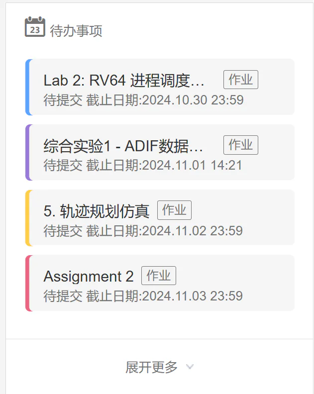
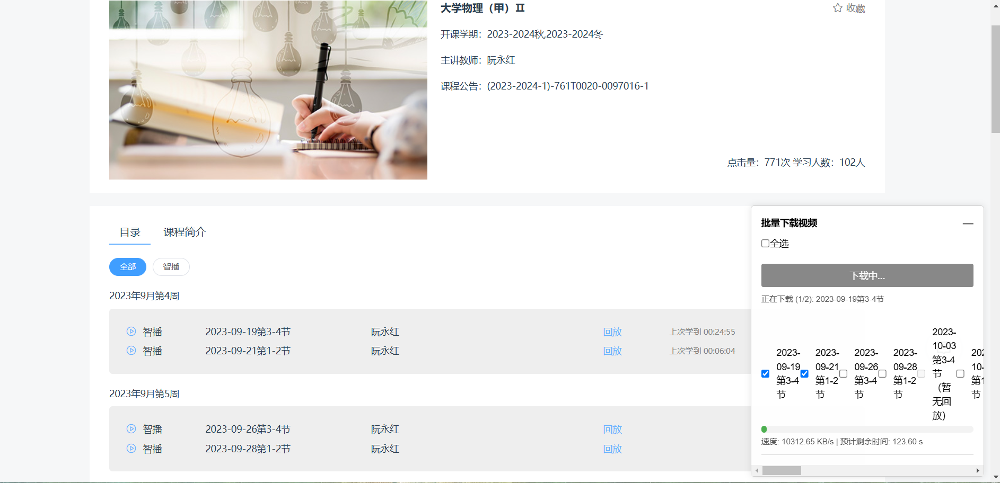
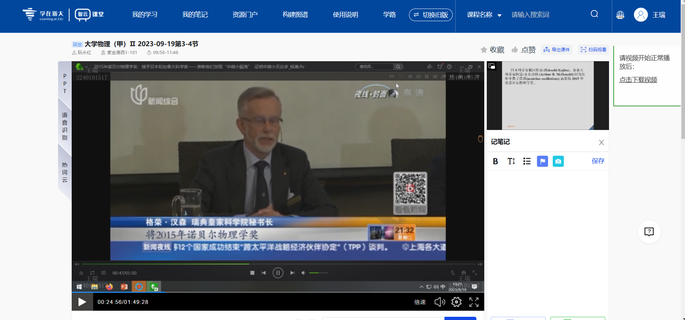
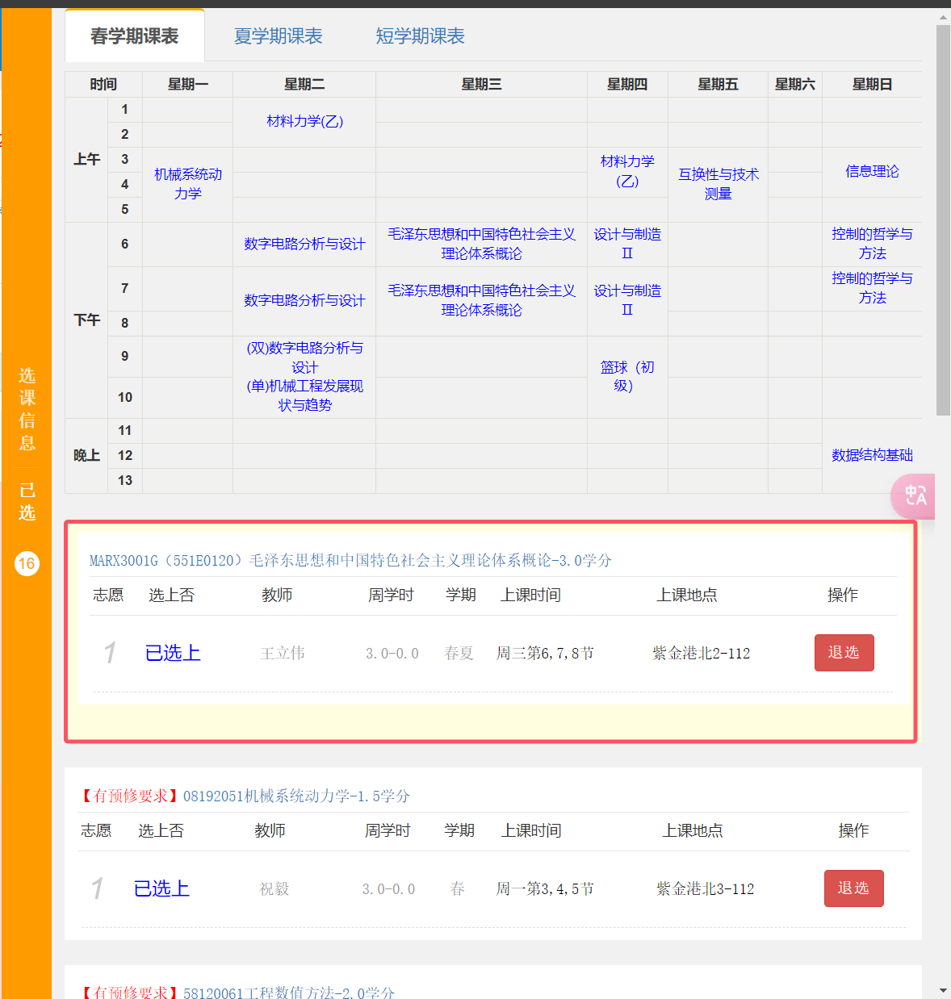

# Enroll_nx -浙江大学全能插件

# 学在浙大功能
## 1.下载ppt或pdf
老师上传的部分ppt或者pdf没有下载按钮，可以通过本插件下载，如图

## 2.待办事项修复
电脑端学在浙大的待办事项（下图）往往会出现无法点击的现象

而且能点击之后，还不能鼠标中键或者右键来新建另一个窗口,本插件可修复时常无法点击的问题

# 智云课堂功能
## 1.批量下载视频

## 2.单独下载视频
点击页面右侧按钮即可下载。

# 教务网功能
## 1.补选显示老师名字

## 2.教材预定显示信息

### 3.选课界面优化
点击课程表中某课程名称可以便捷在下方进行操作

1.无法使用chrome.runtime 与登录有关  存储不成功
与inject.js有关
